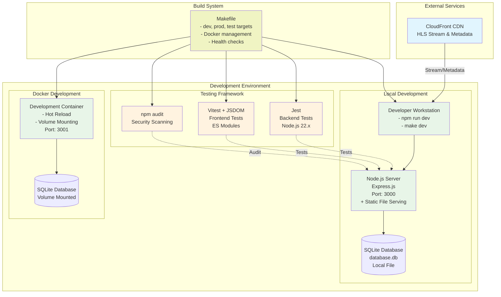
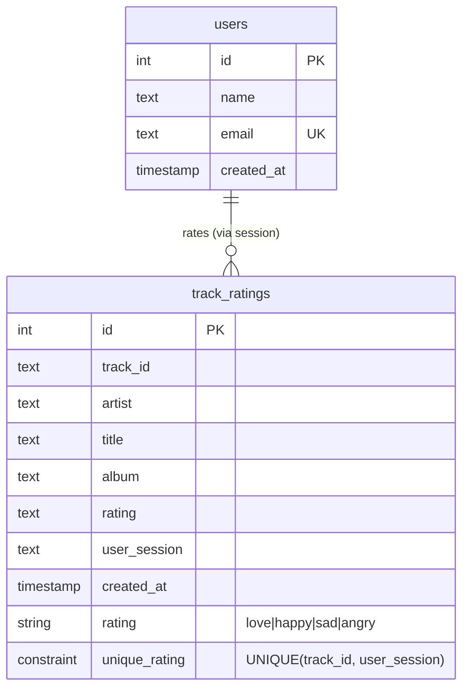
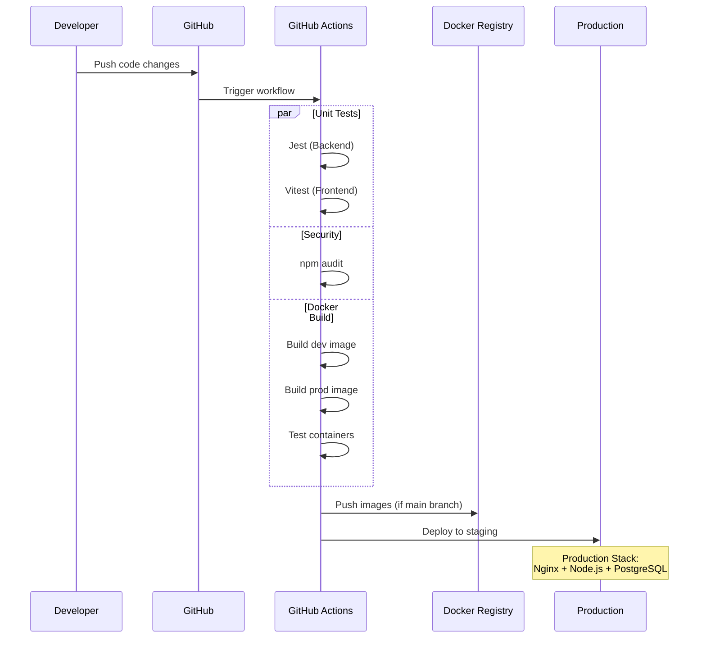
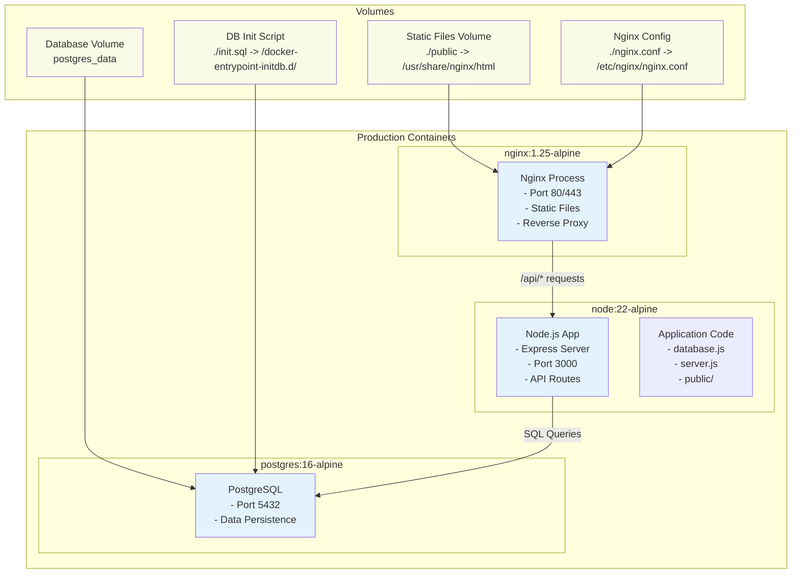

# Quantum Radio - System Architecture

## Overview

Quantum Radio is a streaming radio web application with a multi-tier architecture supporting both development and production deployments. The system features real-time audio streaming, track metadata management, and user rating functionality.

## Production Architecture

```mermaid
graph TB
    subgraph "External Services"
        CDN[CloudFront CDN<br/>HLS Stream & Metadata]
        Codecov[Codecov<br/>Coverage Reports]
    end

    subgraph "CI/CD Pipeline"
        GitHub[GitHub Repository]
        Actions[GitHub Actions<br/>- Unit Tests (Node.js 22.x)<br/>- Security Audit<br/>- Docker Build<br/>- Code Quality]
    end

    subgraph "Production Environment (Docker Compose)"
        subgraph "Frontend Tier"
            Nginx[Nginx Web Server<br/>- Static File Serving<br/>- Gzip Compression<br/>- Security Headers<br/>- Rate Limiting]
        end
        
        subgraph "Application Tier"
            API[Node.js API Server<br/>Express.js + Fingerprint<br/>Port: 3000 (internal)]
        end
        
        subgraph "Database Tier"
            Postgres[(PostgreSQL 16<br/>- users table<br/>- track_ratings table<br/>- Persistent Volume)]
        end
        
        subgraph "Container Network"
            Network[quantum-network<br/>Docker Bridge]
        end
    end

    subgraph "Client Devices"
        Browser[Web Browser<br/>HTML5 + JavaScript<br/>HLS.js Player]
    end

    %% External connections
    CDN -->|HLS Stream| Browser
    CDN -->|Metadata API| Browser
    
    %% CI/CD flow
    GitHub --> Actions
    Actions --> Codecov
    
    %% Production flow
    Browser -->|HTTP:80| Nginx
    Nginx -->|Static Files| Browser
    Nginx -->|/api/* requests| API
    API -->|Database Queries| Postgres
    API -->|User Sessions| API
    
    %% Network connections
    Nginx -.->|Internal Network| Network
    API -.->|Internal Network| Network
    Postgres -.->|Internal Network| Network

    %% Styling
    classDef external fill:#e1f5fe
    classDef frontend fill:#f3e5f5
    classDef backend fill:#e8f5e8
    classDef database fill:#fff3e0
    classDef network fill:#f0f4c3
    classDef cicd fill:#fce4ec

    class CDN,Codecov external
    class Nginx,Browser frontend
    class API backend
    class Postgres database
    class Network network
    class GitHub,Actions cicd
```

## Development Architecture



## Database Architecture



## Deployment Flow



## Container Architecture



## Technology Stack

### Frontend
- **HTML5/CSS3/JavaScript**: Vanilla implementation with ES6 modules
- **HLS.js**: Video streaming library for HTTP Live Streaming
- **CSS Features**: Custom properties, glassmorphism design
- **Fonts**: Montserrat (headings), Open Sans (body)

### Backend
- **Node.js 22.x**: Runtime environment
- **Express.js 5.x**: Web framework with CORS support
- **Database Abstraction**: Supports SQLite (dev) and PostgreSQL (prod)
- **express-fingerprint**: Anonymous user identification
- **dotenv**: Environment configuration

### Database
- **Development**: SQLite3 with file-based storage
- **Production**: PostgreSQL 16 with persistent volumes
- **ORM**: Raw SQL queries with prepared statements
- **Features**: Automatic schema initialization, indexing

### Infrastructure
- **Containerization**: Docker with multi-stage builds
- **Orchestration**: Docker Compose with networking
- **Web Server**: Nginx with compression and security headers
- **CI/CD**: GitHub Actions with multi-job pipeline
- **Testing**: Jest (backend) + Vitest (frontend) with coverage

### Security
- **Vulnerability Scanning**: npm audit integration
- **Container Security**: Non-root users, minimal base images
- **Network Security**: Internal Docker networks
- **Web Security**: Security headers, rate limiting

## Key Design Decisions

### 1. Database Abstraction Layer
- **Problem**: Different databases for dev/prod environments
- **Solution**: `database.js` with conditional PostgreSQL loading
- **Benefit**: Seamless switching between SQLite and PostgreSQL

### 2. Microservice Architecture
- **Problem**: Scalability and separation of concerns
- **Solution**: Nginx (frontend) + Node.js API + PostgreSQL
- **Benefit**: Independent scaling and technology choices

### 3. Container-First Development
- **Problem**: Environment consistency
- **Solution**: Docker containers for all environments
- **Benefit**: "Works on my machine" eliminated

### 4. ES Module/CommonJS Hybrid
- **Problem**: Vitest requires ES modules, server uses CommonJS
- **Solution**: `.mjs` config files for test tooling
- **Benefit**: Modern testing with stable server architecture

### 5. Make-Based Build System
- **Problem**: Complex Docker and npm command combinations
- **Solution**: Organized Makefile with categorized targets
- **Benefit**: Consistent developer experience across environments