# Quantum Radio - System Architecture Diagram

## Core System Architecture


## Deployment Architecture


## Data Flow Architecture


## Testing & CI Architecture

```mermaid
graph TD
    subgraph "🔬 Testing Pipeline"
        subgraph "Backend Tests"
            Jest[Jest<br/>🧪 API Tests<br/>📊 Coverage Reports<br/>🗄️ Database Tests]
        end
        
        subgraph "Frontend Tests"
            Vitest[Vitest + JSDOM<br/>🎨 Component Tests<br/>🔧 Mock APIs<br/>📱 UI Tests]
        end
        
        subgraph "Security Tests"
            Audit[npm audit<br/>🔒 Vulnerability Scan<br/>📋 Dependency Check<br/>⚠️ Security Reports]
        end
        
        subgraph "Integration Tests"
            Docker[Docker Tests<br/>🐳 Container Build<br/>🔗 API Health Check<br/>🌐 Endpoint Tests]
        end
    end

    subgraph "🎯 Test Matrix"
        Node20[Node.js 20.x<br/>LTS Support]
        Node22[Node.js 22.x<br/>Production Version]
    end

    Jest --> Node20
    Jest --> Node22
    Vitest --> Node20
    Vitest --> Node22
    
    Audit --> Security[Security Report]
    Docker --> Health[Health Status]
    
    Node20 --> Results{All Tests Pass?}
    Node22 --> Results
    Security --> Results
    Health --> Results
    
    Results -->|✅ Success| Deploy[🚀 Deploy]
    Results -->|❌ Failure| Block[🚫 Block Deployment]

    classDef test fill:#e8f5e8,stroke:#388e3c,stroke-width:2px
    classDef node fill:#fff3e0,stroke:#f57c00,stroke-width:2px
    classDef decision fill:#ffebee,stroke:#d32f2f,stroke-width:2px
    classDef success fill:#e3f2fd,stroke:#1976d2,stroke-width:2px
    classDef failure fill:#ffebee,stroke:#d32f2f,stroke-width:2px
    
    class Jest,Vitest,Audit,Docker test
    class Node20,Node22 node
    class Results decision
    class Deploy success
    class Block failure
```



## Quick Reference

### 🚀 Production Stack
- **Frontend**: Nginx 1.25 (Alpine) - Port 80/443
- **Backend**: Node.js 22 (Alpine) - Port 3000
- **Database**: PostgreSQL 16 (Alpine) - Port 5432
- **Orchestration**: Docker Compose with internal networking

### 💻 Development Options
- **Local**: Node.js 20/22 + SQLite + Hot reload
- **Docker**: Node.js 18 + Volume mounts + Port 3001

### 🔬 Testing Matrix
- **Unit Tests**: Jest (Backend) + Vitest (Frontend)
- **Node Versions**: 20.x & 22.x compatibility testing
- **Security**: npm audit with vulnerability reporting
- **Integration**: Docker container validation

### 📦 Key Components
- **Audio Streaming**: HLS.js + AWS CloudFront CDN
- **User System**: Anonymous fingerprinting (IP + User-Agent)
- **Rating System**: Emoji-based track ratings (😍😊😢😠)
- **Database**: Users & track_ratings tables with constraints

### 🛠️ Management Commands
```bash
# Development
make dev          # Local development
make dev-docker   # Docker development
make test-all     # Complete test suite

# Production
make prod-docker  # Full production stack
make health       # Service health check
make logs-prod    # Production monitoring

# Utilities
make clean        # Cleanup resources
make help         # Show all commands
```