# Quantum Radio - System Overview

## High-Level Architecture

```mermaid
graph TB
    subgraph "External Services"
        CDN[AWS CloudFront<br/>🎵 HLS Stream<br/>📊 Metadata API]
        GitHub[GitHub Repository<br/>📋 Source Code]
        Codecov[Codecov<br/>📈 Coverage Reports]
    end

    subgraph "CI/CD Pipeline"
        Actions[GitHub Actions<br/>🔬 Node.js 20.x & 22.x Tests<br/>🔒 Security Audits<br/>🐳 Docker Builds<br/>📊 Quality Checks]
    end

    subgraph "Production Environment"
        LoadBalancer[Nginx<br/>🌐 Port 80/443<br/>⚡ Static Files<br/>🔒 Security Headers<br/>🚦 Rate Limiting]
        
        API[Node.js 22 API<br/>🚀 Express.js<br/>👤 User Fingerprinting<br/>🔌 Port 3000]
        
        DB[(PostgreSQL 16<br/>👥 Users<br/>⭐ Track Ratings<br/>💾 Persistent Storage)]
    end

    subgraph "Development Environment"
        LocalDev[Local Development<br/>🔧 Node.js 20.x/22.x<br/>📁 SQLite Database<br/>🔄 Hot Reload]
        
        DevDocker[Docker Dev<br/>🐳 Node.js 18 Container<br/>🔗 Port 3001<br/>📂 Volume Mounts]
    end

    subgraph "Client Layer"
        Browser[Web Browser<br/>🎧 HLS.js Player<br/>⭐ Rating System<br/>📱 Responsive UI]
    end

    %% External connections
    CDN -->|Stream & Metadata| Browser
    GitHub --> Actions
    Actions --> Codecov
    
    %% Production flow
    Browser <-->|HTTPS/HTTP| LoadBalancer
    LoadBalancer <-->|API Requests| API
    LoadBalancer -->|Static Assets| Browser
    API <-->|SQL Queries| DB
    
    %% Development flow
    Browser <-->|Development| LocalDev
    Browser <-->|Docker Dev| DevDocker
    
    %% CI/CD deployment
    Actions -.->|Deploy| LoadBalancer

    %% Styling
    classDef external fill:#e3f2fd,stroke:#1976d2,stroke-width:2px
    classDef production fill:#e8f5e8,stroke:#388e3c,stroke-width:2px
    classDef development fill:#fff3e0,stroke:#f57c00,stroke-width:2px
    classDef cicd fill:#fce4ec,stroke:#c2185b,stroke-width:2px
    classDef client fill:#f3e5f5,stroke:#7b1fa2,stroke-width:2px

    class CDN,GitHub,Codecov external
    class LoadBalancer,API,DB production
    class LocalDev,DevDocker development
    class Actions cicd
    class Browser client
```



## Technology Stack


## Data Flow Architecture


## Container Architecture


## Development Workflows

```mermaid
flowchart TD
    Dev[👩‍💻 Developer] --> Choice{Environment?}
    
    Choice -->|Local| Local[🔧 Local Setup]
    Choice -->|Docker| Docker[🐳 Docker Dev]
    Choice -->|Production| Prod[🚀 Production]
    
    Local --> LocalSteps[📝 npm install<br/>🔧 npm run dev<br/>🧪 npm test<br/>🔒 npm run test:security]
    
    Docker --> DockerSteps[🔨 make dev-docker<br/>📊 make logs<br/>🧪 make test<br/>🔍 make health]
    
    Prod --> ProdSteps[🏗️ make prod-docker<br/>📋 docker-compose.prod.yml<br/>🔐 PostgreSQL + Nginx]
    
    LocalSteps --> Test[🧪 Testing]
    DockerSteps --> Test
    ProdSteps --> Deploy[🚀 Deployment]
    
    Test --> Results{Tests Pass?}
    Results -->|✅ Yes| Commit[📝 Git Commit]
    Results -->|❌ No| Fix[🔧 Fix Issues]
    Fix --> Test
    
    Commit --> Push[📤 Git Push]
    Push --> CI[⚙️ CI Pipeline]
    CI --> Deploy

    classDef developer fill:#e8f5e8
    classDef process fill:#fff3e0
    classDef decision fill:#ffebee
    classDef success fill:#e3f2fd
    
    class Dev,Local,Docker,Prod developer
    class LocalSteps,DockerSteps,ProdSteps,Test,Commit,Push,CI process
    class Choice,Results decision
    class Deploy success
```



## Key Features

### 🎵 Audio Streaming
- **HLS.js Integration**: HTML5 video streaming with adaptive bitrate
- **Real-time Metadata**: Track information fetched every 10 seconds
- **CloudFront CDN**: Global content delivery for audio and metadata

### ⭐ User Ratings
- **Anonymous Users**: Fingerprint-based identification (IP + User-Agent)
- **Emoji Ratings**: Love 😍, Happy 😊, Sad 😢, Angry 😠
- **Real-time Updates**: Live rating statistics and user feedback

### 🏗️ Multi-Environment Support
- **Development**: SQLite + Node.js 18 (Docker) / 20-22 (Local)
- **Production**: PostgreSQL + Nginx + Node.js 22
- **Testing**: Jest (Backend) + Vitest (Frontend) on Node.js 20 & 22

### 🔒 Security & Quality
- **Automated Security Audits**: npm audit integration in CI
- **Container Security**: Non-root users, minimal base images
- **Web Security**: Security headers, rate limiting, CORS protection

### 🚀 DevOps & CI/CD
- **GitHub Actions**: Multi-job pipeline with Node.js matrix testing
- **Docker First**: All environments containerized
- **Make Automation**: Simplified commands for all operations
- **Coverage Reports**: Automatic coverage tracking with Codecov

## Quick Start Commands

```bash
# Development
make dev          # Local development server
make dev-docker   # Containerized development
make test-all     # Run tests + security audit

# Production  
make prod-docker  # Full production stack
make health       # Check service status
make logs-prod    # Monitor production logs

# Utilities
make clean        # Clean up resources
make help         # Show all commands
```